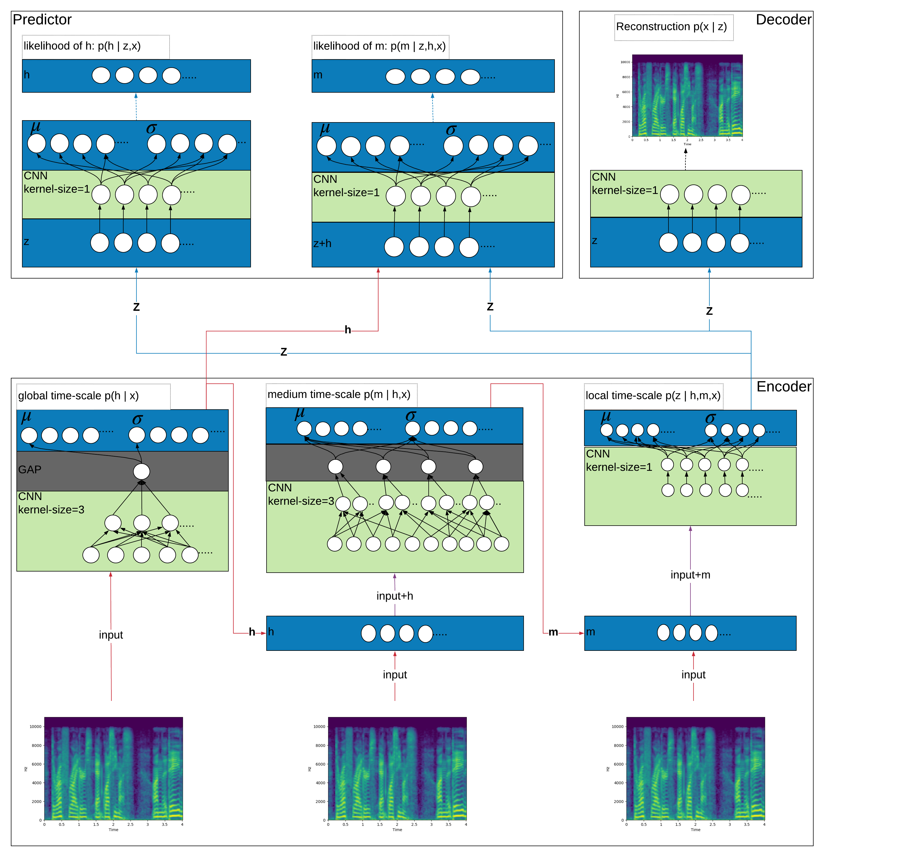

This repository contains the code and results of applying a multi-timescal Aux-VAE architecture to audio speach data. The architecture consists of a global auxiliary variable to extract a low dimensional representation for tasks that depend on fixed features, which does not change with time like speaker identification and gender classification, and a medium auxiliary variable for tasks that depend on features,which take a considerable amout of time to change such as the emotion. The model was implemented in [PyTorch](https://github.com/pytorch/pytorch).

### Multi-Timescale Aux-VAE
<p align="center"></p>

## Running the Code
First of all you need to install the "torchaudio" library by going to the folder "audio" and openning there an a terminal, then insert the following command: 
```
sudo apt-get install sox libsox-dev libsox-fmt-all
python setup.py install
```
### Preprocessing

In order to preprocess the [OMG dataset](https://github.com/knowledgetechnologyuhh/OMGEmotionChallenge), please download the audio version of the dataset and then run:
```
python prepare_OMG.py --OMG-path={DIR TO OMG AUDIOS}
```

{DIR TO OMG DIRECTORY} to be replaced by the directory to the audio data of the OMG-dataset. This directory is the folder "OMG_Emotion_audio" in this repository"

In order to preprocess the LibriSpeech dataset, please download the train-clean-100 subset first from (http://www.openslr.org/resources/12/train-clean-100.tar.gz) and then run:
```
python preprocess_librispeech.py --librispeech-path={DIR TO LibriSpeech DIRECTORY}
```

### Running the Model

Models can be trained by running the main.py script. Important options include batch-size, learning-rate, the size of the hidden representaion and number of epochs

The Aux-VAE model can be trained by:
```
python main.py --model-type=vae_g_l --dataset=OMGEmotion/LibriSpeech
```

For additional options (such as setting hyperparameters) see:
```
python main.py --h
```

To analyse latent representations first run:
```
python main.py --model-type=TYPE_OF_MODEL --mode=analyse-latent --dataset=OMGEmotion/LibriSpeech
```
To create t-SNE plots (only with the LibriSpeech dataset, not with OMG) then run:
```
python tsne_plotter.py
```

To train a linear classifier, using the OMG-Emotion dataset, on top of representations learned by the model, run:
```
python speaker_id.py --pretrained-model=TYPE_OF_MODEL --task={0,1}
```
where "0" for speaker identification and "1" for gender classification.

To train a linear classifier, using the LibriSpeech dataset, on top of representations learned by the model, run:
```
python librispeech_speaker_id.py --pretrained-model=TYPE_OF_MODEL --task={0,1}
```
where "0" for speaker identification and "1" for gender classification.
### Dependencies
* [Numpy](http://www.numpy.org)
* [Scipy](https://www.scipy.org)
* [LibROSA](https://librosa.github.io/librosa/)
* [SOX](http://sox.sourceforge.net)
* [PyTorch](https://pytorch.org)
* [torchaudio](https://github.com/pytorch/audio)
* [ujson](https://pypi.org/project/ujson/)
* [tqdm](https://github.com/tqdm/tqdm)
* [tensorboardX](https://github.com/lanpa/tensorboardX)
* [Scikit-Learn](http://scikit-learn.org/stable/) (optional, for tsne plots and silhouette scores)
